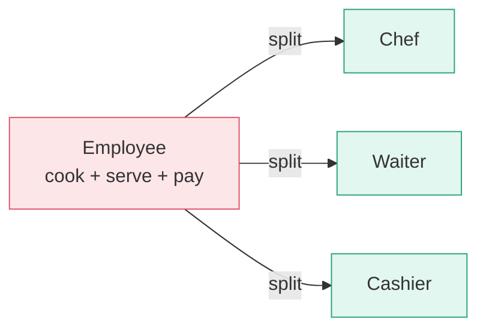
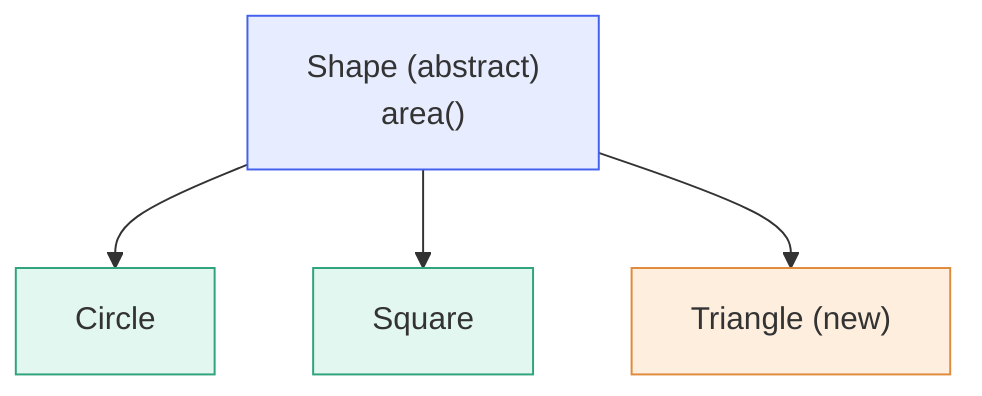
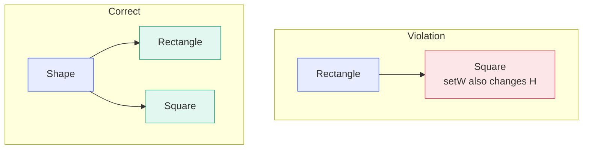
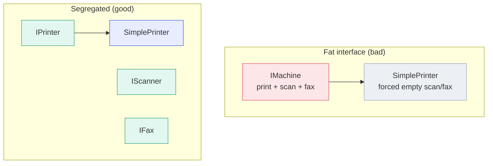
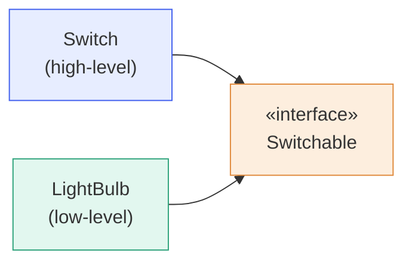

# SOLID Principles in C++

> Five object-oriented design principles (by Robert C. Martin) that make code
> **easy to maintain, extend, and test** by reducing tight coupling.

| Letter | Principle | One-line idea |
|:------:|-----------|---------------|
| **S** | Single Responsibility | A class should have only one reason to change. |
| **O** | Open / Closed | Open for extension, closed for modification. |
| **L** | Liskov Substitution | Subtypes must be usable in place of their base type. |
| **I** | Interface Segregation | Don't force clients to depend on methods they don't use. |
| **D** | Dependency Inversion | Depend on abstractions, not concrete classes. |

---

## S — Single Responsibility Principle (SRP)

**Definition:** A class should have **only one reason to change** — it should do exactly one job.

**Real example:** In a restaurant, the **chef** cooks, the **waiter** serves, and the **cashier** handles money. If one person did all three, changing the payment machine would also disturb the cooking.

**Diagram:**



**Code example:**

```cpp
// BAD: one class doing two jobs
class Report {
public:
    void generate();    // build data
    void saveToFile();  // persistence -> extra reason to change
};

// GOOD: split responsibilities
class Report      { public: void generate(); };
class ReportSaver { public: void save(const Report&); };
```

---

## O — Open / Closed Principle (OCP)

**Definition:** Software entities should be **open for extension but closed for modification**. Add new behaviour by writing new code, not editing tested code.

**Real example:** A **power strip** — to add a device you plug it in, you don't rewire the wall. New appliances extend the system without changing it.

**Diagram:**



**Code example:**

```cpp
class Shape { public: virtual double area() = 0; };

class Circle : public Shape {
    double r;
public: double area() override { return 3.14 * r * r; }
};

// Add a new shape by EXTENDING, not editing existing code:
class Square : public Shape {
    double s;
public: double area() override { return s * s; }
};
```

---

## L — Liskov Substitution Principle (LSP)

**Definition:** Objects of a **derived class must be substitutable for their base class** without breaking the program. A subclass must honour its parent's contract.

**Real example:** A **Penguin** "is a" Bird, but if `Bird` promises `fly()`, Penguin breaks it. Classic code case: a **Square** inheriting from **Rectangle** breaks callers that set width and height independently.

**Diagram:**



**Code example:**

```cpp
// A function written against the base type...
void printArea(Shape& s) { std::cout << s.area(); }

// ...must work for ANY subtype passed in:
Circle c;  printArea(c);   // OK
Square sq; printArea(sq);  // OK — no surprises, no crashes

// A Square that secretly changes height when width is set
// would violate LSP: callers get unexpected results.
```

---

## I — Interface Segregation Principle (ISP)

**Definition:** Clients should **not be forced to depend on methods they don't use**. Prefer several small, focused interfaces over one large "fat" interface.

**Real example:** A basic **printer** shouldn't be forced to implement `scan()` and `fax()` just because an "all-in-one" interface lists them.

**Diagram:**



**Code example:**

```cpp
// BAD: forces every printer to implement scan()
class IMachine {
    virtual void print() = 0;
    virtual void scan()  = 0;   // not all printers scan!
};

// GOOD: small role interfaces
class IPrinter { public: virtual void print() = 0; };
class IScanner { public: virtual void scan()  = 0; };
class SimplePrinter : public IPrinter { void print() override {} };
```

---

## D — Dependency Inversion Principle (DIP)

**Definition:** High-level modules should **not depend on low-level modules**; both should depend on **abstractions**. Details depend on abstractions, not the reverse.

**Real example:** A **laptop charger** plugs into a standard socket (the abstraction), not directly to a power plant. In code, a `Switch` should talk to a `Switchable` interface, not a concrete `LightBulb`.

**Diagram:**



**Code example:**

```cpp
class Switchable { public: virtual void on() = 0; };

class LightBulb : public Switchable {
public: void on() override { /* light on */ }
};

class Switch {                 // high-level module
    Switchable& dev;           // depends on abstraction
public:
    Switch(Switchable& d) : dev(d) {}
    void press() { dev.on(); }
};
```

---

## Quick Memory Hook

| Letter | Hook |
|:------:|------|
| **S** | one job |
| **O** | extend, don't edit |
| **L** | subtypes swap cleanly |
| **I** | small interfaces |
| **D** | depend on abstractions |

---

## Interview Questions

<details>
<summary><b>Click to expand 22 interview questions & answers</b></summary>

**Q1. What does SOLID stand for?**
Single Responsibility, Open/Closed, Liskov Substitution, Interface Segregation, Dependency Inversion — five OOP design principles by Robert C. Martin.

**Q2. Why are SOLID principles important?**
They reduce coupling, increase cohesion, and make code easier to test, extend, and maintain, limiting the ripple effect of changes.

**Q3. Explain the Single Responsibility Principle.**
A class should have only one reason to change (one responsibility). Mixing concerns means a change to one can break the other.

**Q4. How do you detect an SRP violation?**
If you describe a class using "and" (does X *and* Y), or unrelated changes keep forcing edits to the same class, it has multiple responsibilities.

**Q5. Explain the Open/Closed Principle.**
Entities should be open for extension but closed for modification — add features via new subclasses/implementations, not by editing tested code.

**Q6. How is OCP achieved in C++?**
Through abstraction and polymorphism: abstract base classes, pure virtual functions, templates, and strategy-style interfaces.

**Q7. What problem does OCP solve?**
It prevents regression bugs — working code isn't modified, so existing tests and shipped features stay stable.

**Q8. Explain the Liskov Substitution Principle.**
A subclass object must be usable wherever a base-class object is expected, without changing correctness. Subtypes must honour the base contract.

**Q9. Give a classic LSP violation.**
The Rectangle/Square problem: Square inherits Rectangle but setting width also changes height. Also Penguin inheriting a Bird that can `fly()`.

**Q10. How do you fix an LSP violation?**
Rethink the hierarchy — favour composition or a shared abstraction (e.g. a common `Shape` base) instead of a broken "is-a" relationship.

**Q11. Explain the Interface Segregation Principle.**
Don't force a class to implement methods it doesn't need. Split large "fat" interfaces into smaller, role-specific ones.

**Q12. What is a "fat interface"?**
An interface with many unrelated methods, forcing implementers to write empty or throwing stubs — a sign ISP is violated.

**Q13. How does C++ implement interfaces?**
Via abstract classes with only pure virtual functions (`= 0`). Multiple inheritance lets a class combine several small interfaces.

**Q14. Explain the Dependency Inversion Principle.**
High-level and low-level modules should both depend on abstractions, not on each other. Details depend on abstractions, not vice-versa.

**Q15. Difference between Dependency Inversion and Dependency Injection?**
DIP is a design principle (depend on abstractions). Dependency Injection is a technique to achieve it — supplying dependencies from outside.

**Q16. How does DIP improve testability?**
Modules depend on interfaces, so you can inject mock/stub implementations in tests instead of real DBs or hardware.

**Q17. Which SOLID principles rely on polymorphism?**
Mainly OCP, LSP, and DIP — all use base-class pointers/references and virtual dispatch so concrete types vary behind a stable abstraction.

**Q18. Can SOLID be over-applied?**
Yes. Excessive abstraction adds indirection and boilerplate. Apply where change is likely; avoid speculative interfaces (YAGNI).

**Q19. How do SRP and ISP relate?**
Both promote small, focused units — SRP for classes (one responsibility), ISP for interfaces (one role/client concern).

**Q20. What C++ features help follow SOLID?**
Pure virtual functions, abstract classes, references/smart pointers, templates and concepts, and `override`/`final` keywords.

**Q21. How does SOLID relate to design patterns?**
Patterns are concrete solutions built on SOLID ideas — Strategy/Factory support OCP/DIP, Adapter supports ISP. SOLID is the "why", patterns the "how".

**Q22. Give a one-line memory hook for each letter.**
**S**: one job · **O**: extend don't edit · **L**: subtypes swap cleanly · **I**: small interfaces · **D**: depend on abstractions.

</details>